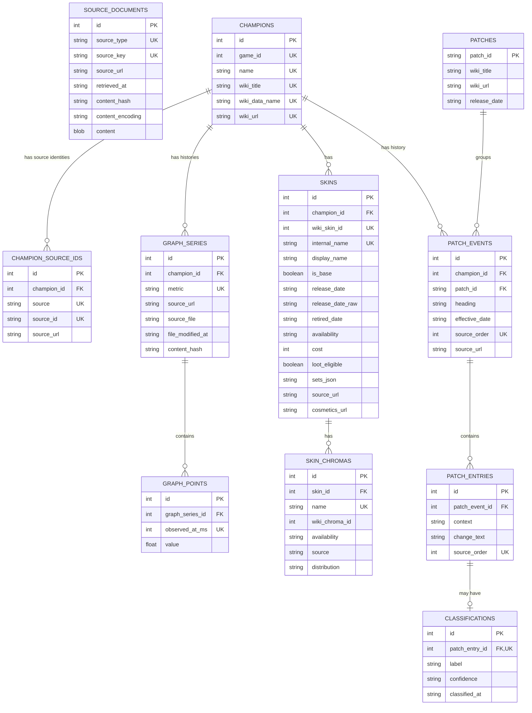

# Database entity-relationship diagram

This diagram represents the tables currently created by the Python collectors, offline importer, and classifier.



`source_documents` is deliberately standalone: its `source_type` and `source_key` identify the cached raw API document without coupling normalized rows to a particular snapshot. Composite uniqueness constraints are shown as `UK` on their participating fields.

## Rendering locally

GitHub renders the Mermaid block directly. To produce standalone images with Mermaid CLI:

```bash
npx -p @mermaid-js/mermaid-cli@11.15.0 mmdc \
  -i docs/db_data_model.md \
  -o docs/db_data_model.svg \
  -b white

npx -p @mermaid-js/mermaid-cli@11.15.0 mmdc \
  -i docs/db_data_model.md \
  -o docs/db_data_model.png \
  -w 4000 \
  -H 3000 \
  -b white
```

If Chromium is not already available to Puppeteer, install the version requested by the installed Mermaid CLI package before rendering.

On a minimal Linux or WSL installation, Chromium also needs at least one system font. If Mermaid reports
`svg element not in render tree` for an ER diagram and `fc-list` returns no fonts, install Fontconfig and a font family,
then rebuild the font cache:

```bash
sudo apt update
sudo apt install fontconfig fonts-dejavu-core
fc-cache -f
```

The error occurs because Mermaid measures ER-diagram labels as SVG text; without a usable font, Chromium reports a
zero-sized text box. Rerun the same `mmdc` command after the fonts are installed.
